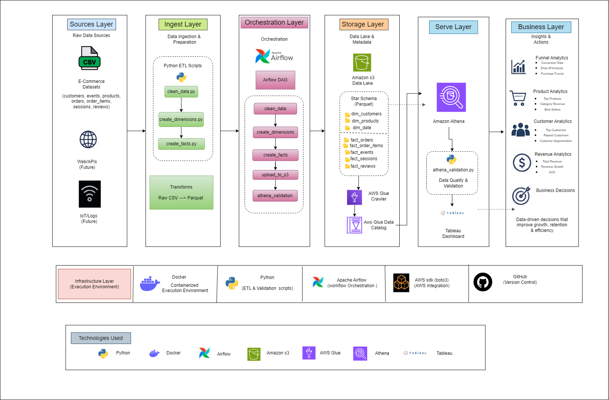
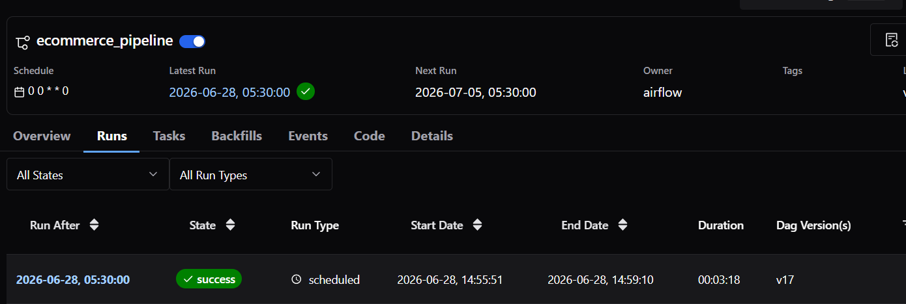
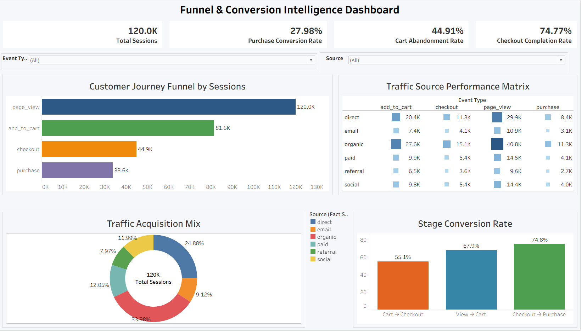
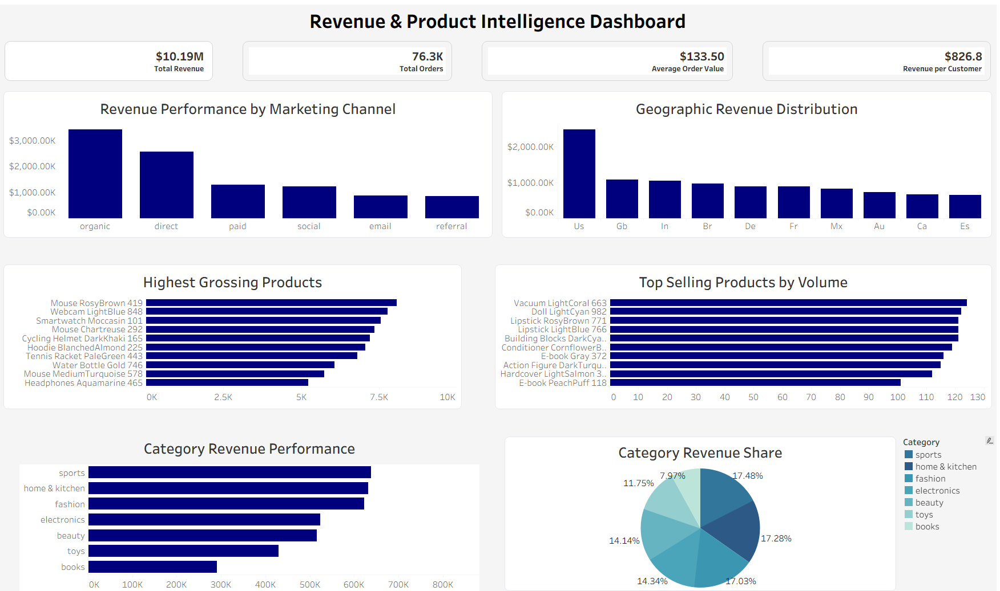
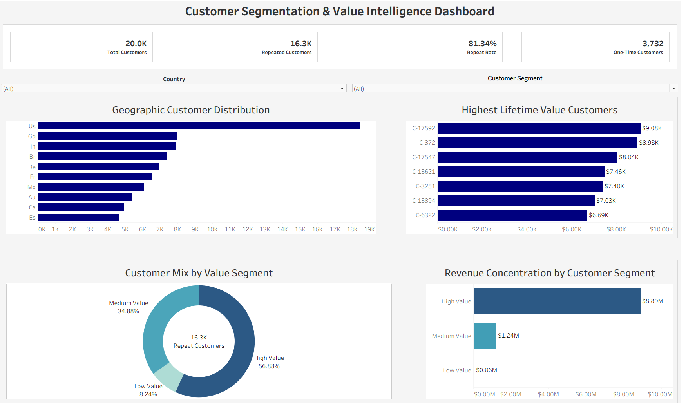

# Metadata-Driven Cloud Analytics Engineering Platform

An end-to-end analytics engineering project that automates the transformation of raw e-commerce data into a business-ready analytics platform.

The pipeline uses **Apache Airflow** for workflow orchestration, stores optimized **Parquet** datasets in **Amazon S3**, manages metadata with **AWS Glue**, validates warehouse data using **Amazon Athena**, and delivers interactive dashboards through a **live Tableau–Athena connection**. The repository also includes a **GitHub Actions CI pipeline** that automatically validates the project on every code change.

---

## Architecture

<p align="center">

</p>

The solution follows a layered architecture that separates ingestion, orchestration, storage, metadata management, analytics, and business intelligence, making the pipeline modular and easy to maintain.

---

# Project Overview

This project demonstrates how a modern analytics engineering workflow can be built using Python, Docker, Apache Airflow, and AWS services.

Starting from raw e-commerce CSV datasets, the pipeline automatically:

- Cleans and transforms raw data
- Builds a Star Schema warehouse
- Stores Parquet datasets in Amazon S3
- Updates metadata using AWS Glue
- Validates warehouse tables with Amazon Athena
- Serves analytics directly to Tableau through Athena
- Runs automated CI checks using GitHub Actions

The complete workflow is orchestrated through Apache Airflow inside a Docker environment.

---

# Technology Stack

| Category | Technology |
|----------|------------|
| Programming | Python |
| Workflow Orchestration | Apache Airflow |
| Containerization | Docker |
| Cloud Storage | Amazon S3 |
| Metadata | AWS Glue Crawler & Glue Data Catalog |
| Query Engine | Amazon Athena |
| Visualization | Tableau |
| Data Format | Parquet |
| CI/CD | GitHub Actions |
| Version Control | Git & GitHub |

---

# Pipeline Workflow

```text
Raw CSV Data
      │
      ▼
Python ETL
      │
      ▼
Apache Airflow
      │
      ▼
Amazon S3 Data Lake
      │
      ▼
AWS Glue Crawler
      │
      ▼
Glue Data Catalog
      │
      ▼
Amazon Athena
      │
      ▼
Data Validation
      │
      ▼
Tableau (Live Connection)
      │
      ▼
Business Insights
```

---

# Airflow Workflow

The entire pipeline is orchestrated through a single Apache Airflow DAG.

<p align="center">

</p>

```text
clean_data
      │
      ▼
create_dimensions
      │
      ▼
create_facts
      │
      ▼
upload_to_s3
      │
      ▼
athena_validation
```

Each task has a single responsibility, making the workflow modular, reusable, and easier to monitor.

---

# Data Warehouse

The warehouse is modeled using a **Star Schema**.

### Dimension Tables

- dim_customers
- dim_products
- dim_date

### Fact Tables

- fact_orders
- fact_order_items
- fact_events
- fact_reviews
- fact_sessions

The warehouse is stored as **Parquet** datasets to improve storage efficiency and analytical query performance.

---

# Data Validation

Before the warehouse is consumed by downstream analytics, Amazon Athena validates the generated datasets.

Validation checks include:

- Table accessibility
- Successful data loading
- Row count verification
- Query execution status

After validation, Tableau connects directly to Amazon Athena, ensuring dashboards always query the latest validated warehouse.

---

# Dashboard Overview

The dashboards are built using Tableau with a **live Amazon Athena connection**, eliminating manual exports while ensuring visualizations always reflect the latest validated data.

## Funnel Analytics

<p align="center">

</p>

Measures user movement across the purchase funnel, conversion rates, and customer drop-off points.

---

## Revenue Analytics

<p align="center">

</p>

Analyzes revenue trends, average order value, sales distribution, and category performance.

---

## Customer Analytics

<p align="center">

</p>

Provides customer segmentation, top customers, and geographical analysis.

---

## Product Analytics

<p align="center">

</p>

Evaluates product performance, category contribution, and revenue distribution.

---

# Continuous Integration

The repository includes a **GitHub Actions CI pipeline** that automatically runs whenever code is pushed or a pull request is opened.

The workflow performs:

- Repository checkout
- Python environment setup
- Dependency installation
- Python syntax validation
- SQL directory verification
- Docker image build

This helps ensure the project remains buildable and free from basic integration issues before new changes are merged.

---

---

# Pipeline Output

- ✓ Raw datasets cleaned
- ✓ Star Schema warehouse generated
- ✓ Parquet files uploaded to Amazon S3
- ✓ Metadata catalog updated using AWS Glue
- ✓ Warehouse validated with Amazon Athena
- ✓ Tableau dashboards connected through Athena
- ✓ Automated CI validation using GitHub Actions

---

# Future Improvements

- Automated data quality testing
- Incremental data loading
- CloudWatch monitoring
- Infrastructure as Code (Terraform)
- Automated deployment workflow

---

## Author

**Sujal Gupta**

Computer Science Undergraduate | Data Engineering & Analytics

GitHub: https://github.com/gsujal421
